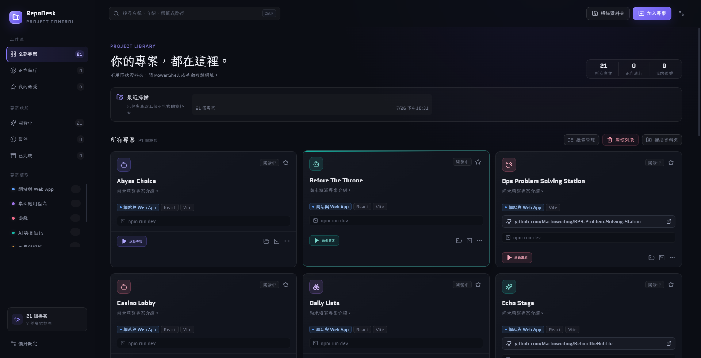
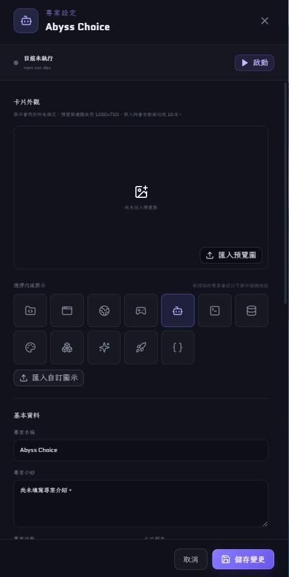
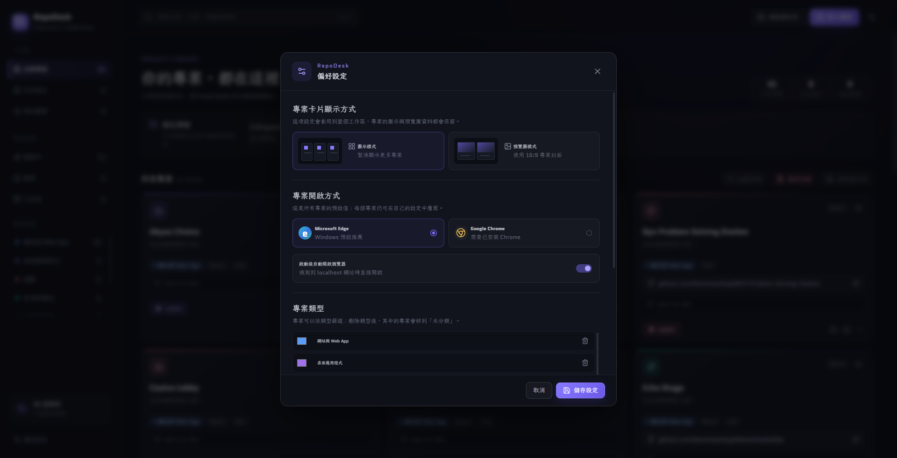

# RepoDesk

  Windows 本機專案控制中心，從同一個視窗整理、啟動與查看你的專案。

  <a href="README.md">繁體中文</a>
  ·
  <a href="README.en.md">English</a>

  
  
  

  <a href="https://github.com/Martinweiting/RepoDesk/releases/download/v0.5.0/RepoDesk-Setup-v0.5.0.exe"><strong>下載 Windows 安裝程式</strong></a>
  ·
  <a href="https://github.com/Martinweiting/RepoDesk/releases/latest">查看最新版本</a>

RepoDesk 把散落在不同磁碟與資料夾中的本機專案收進一個工作區。你可以掃描專案、補上封面與說明、設定啟動命令，再從卡片直接啟動開發伺服器、查看終端輸出或開啟網站。

## 適合哪些使用情境

當專案數量增加，找資料夾、開啟終端機、輸入命令與複製本機網址會反覆佔用時間。RepoDesk 保存每個專案的路徑與開啟設定，並提供下列操作：

- 掃描資料夾，一次加入多個本機專案。
- 依名稱、介紹、標籤、路徑、狀態與類型尋找專案。
- 從卡片啟動、停止或重新啟動專案。
- 查看即時終端輸出，偵測 `localhost` 網址後開啟瀏覽器。
- 掃描並啟動沒有 `package.json` 的 Windows 應用程式，例如 `.exe`、`.cmd`、`.bat` 與 `.ps1`。
- 將 `build`、`test`、`lint` 等次要腳本分開整理，必要時可在專案設定中升格為主要命令。
- 直接開啟專案資料夾、PowerShell、Visual Studio Code 或 GitHub 頁面。
- 用收藏、狀態、自訂類型、圖示與預覽圖整理大型專案清單。

## 下載與安裝

RepoDesk `v0.5.0` 提供 Windows x64 安裝程式。系統需求如下：

- Windows 10 或 Windows 11，x64。
- 受管理專案本身所需的執行環境，例如 Node.js、Godot、Python、Rust 或 .NET。
- Microsoft Edge，Windows 通常已內建。Google Chrome 與 Visual Studio Code 為選用項目。

安裝步驟：

1. 前往 [Releases](https://github.com/Martinweiting/RepoDesk/releases/latest)，下載 `RepoDesk-Setup-v0.5.0.exe`。
2. 開啟安裝程式，選擇安裝位置。
3. 從桌面捷徑或開始功能表啟動 RepoDesk。

目前的安裝程式尚未數位簽章。若 Windows SmartScreen 顯示警告，請確認檔案來自本專案的 GitHub Releases，再選擇「其他資訊」與「仍要執行」。

## 第一次加入專案

### 掃描一整個專案資料夾

1. 在右上角按下「掃描資料夾」。
2. 選擇存放多個專案的上層資料夾。
3. RepoDesk 會依設定的掃描深度尋找可辨識的專案，完成後顯示找到、新增與更新的數量。
4. 回到首頁檢查卡片。再次掃描相同位置時，既有項目會更新，不會重複加入。

RepoDesk 每次都會請你重新選擇掃描位置，不會保存預設的掃描根目錄。首頁只保留最近五筆不重複的掃描紀錄，方便確認最近整理過的位置。

### 只加入一個專案

按下「加入專案」，選擇該專案的資料夾。RepoDesk 會讀取可用的專案檔案，帶入名稱、介紹、技術標籤、GitHub 網址與候選啟動命令。

### 可辨識的專案

| 專案類型 | 辨識依據 | 可自動帶入的命令 |
| --- | --- | --- |
| Node.js 與網頁專案 | `package.json` | `npm run dev`、`npm run start`、`npm run serve` 或 `npm run preview` |
| Godot | `project.godot` | `godot --editor` |
| Python | `pyproject.toml`，搭配 `app.py` 時可啟動 | `python app.py` |
| Rust | `Cargo.toml` | `cargo run` |
| .NET | `.sln` | `dotnet run` |
| Windows 應用程式 | `.exe`、`.cmd`、`.bat` 或 `.ps1` | 依檔案自動建立啟動命令 |

## 設定卡片並啟動專案

按下專案卡片即可開啟設定面板。這裡可以更改名稱、介紹、標籤、狀態、類型、強調色、啟動命令、瀏覽器、固定網址與 GitHub 網址。

建議依照下列順序完成第一張卡片：

1. 確認「啟動命令」可以在該專案資料夾中正常執行。
2. 選擇一個內建圖示，或匯入自訂圖示與 16:9 預覽圖。
3. 若伺服器輸出不會顯示 `localhost` 網址，請填入固定網址。
4. 儲存變更，回到首頁按下「啟動專案」。
5. 按下卡片上的命令列查看即時終端輸出。啟動後可用「開啟網站」進入偵測到的網址，停止按鈕會結束整個程序樹。

啟動命令會以目前的 Windows 使用者權限執行。請只加入你信任的專案，並在執行陌生命令前先檢查內容。

## 整理專案清單

搜尋框可比對名稱、介紹、標籤與完整路徑，按下 `Ctrl+K` 可直接將游標移到搜尋框。左側欄可切換正在執行、我的最愛、開發中、暫停、已完成，以及各個自訂專案類型。

在「偏好設定」中可以切換圖示模式與預覽圖模式、選擇預設瀏覽器、控制偵測到網址後是否自動開啟、設定 Windows 登入後自動啟動，並新增或調整專案類型。個別專案仍可覆寫全域瀏覽器設定。

其他整理方式：

- 星號會把常用專案排在清單前方。
- 「批量管理」可以選取目前搜尋或篩選結果中的多張卡片。
- 自訂圖示會裁切為 256×256，預覽圖會裁切為 1280×720。
- 卡片下方的按鈕可開啟檔案總管與 PowerShell，更多設定中可開啟 Visual Studio Code。

## 本機資料與刪除行為

RepoDesk 沒有帳號與雲端同步功能。專案清單及偏好設定保存在 Electron 的本機 `userData` 目錄，資料檔名為 `repodesk-data.json`。

從卡片選單、批量管理或「清空列表」移除專案，只會刪除 RepoDesk 中的紀錄。原始專案資料夾與其中的檔案不會被刪除。掃描時也不會修改受管理專案的內容。

## 版本檢查與更新

設定中的「版本檢查」會先查詢 GitHub Releases；如果儲存庫尚未建立公開 Release，則改讀 GitHub 上的專案版本資訊。發現新版本時，可以直接前往下載頁面。

目前版本 `v0.5.0` 的安裝檔 SHA-256：`6539FDAFFCE39568AA28FEA2DEA49461F0DFB5F42A0F3516637577D2B00DE27D`

安裝檔名稱：`RepoDesk-Setup-v0.5.0.exe`

## 目前版本的使用限制

- 目前僅提供 Windows x64 安裝程式。
- RepoDesk 需要依賴各專案已安裝的執行環境與命令列工具。
- Google Chrome 與 Visual Studio Code 需另外安裝，相關快捷操作才可使用。
- 找不到原始資料夾時，卡片會標示路徑失效，啟動功能會暫停使用。
- 每次關閉 RepoDesk 時，仍在執行的受管理程序會一併停止。

## 版本

目前公開版本為 `v0.5.0`，發行內容包括專案掃描與管理、Windows 應用程式啟動、可自訂開啟網址、主要與次要腳本分類、原始資料夾名稱保留、深色與亮色模式、卡片尺寸與欄數、來源資料夾篩選、Windows 捷徑拖放加入、卡片外觀、自訂類型、即時終端輸出、開發網址偵測、版本檢查、Windows 登入後自動啟動，以及 Edge 與 Chrome 開啟設定。安裝檔與 SHA-256 校驗值列於 [GitHub Release](https://github.com/Martinweiting/RepoDesk/releases/tag/v0.5.0)。
